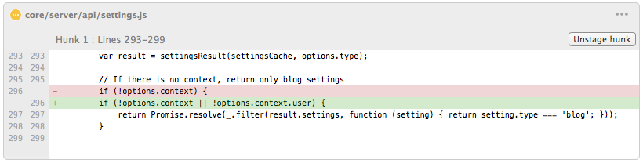
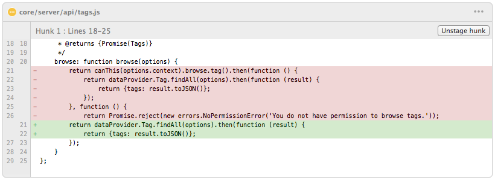
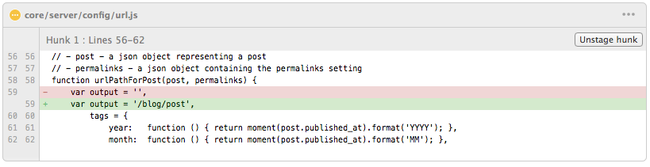
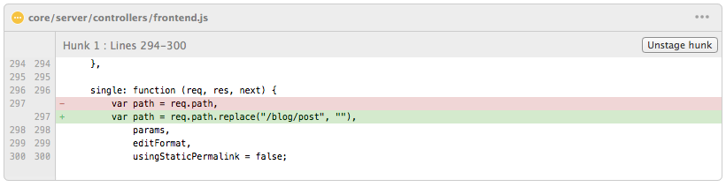
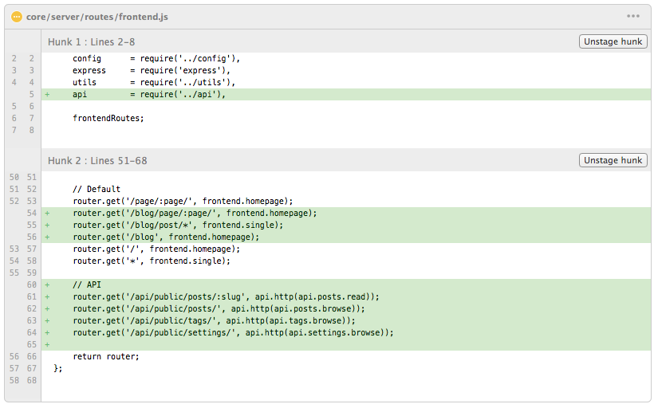

# //hedgehog.com.ua - Dmitry's Antonenko personal website

## About projects
This is SPA application of my personal web site at hedgehog.com.ua, that is built by Google Closure Tools on client side (Closure Library, Closure Compiler, Closure Templates) and Ghost blog engine from backend.

### Install Grunt
From the command line:

1. Install `grunt-cli` globally with `npm install -g grunt-cli`.
2. Navigate to the root directory, then run `npm install`. npm will look at [package.json] and automatically install the necessary local dependencies listed there.

### Build third-party libraries/tools
1. Compile Closure Compiler:
    * Install JDK <http://www.oracle.com/technetwork/java/javase/downloads/index.html>
    * Install ant <http://ant.apache.org/>
    * Execute command `ant jar` inside `tools/closure-compiler` folder
2. Install required packages for Hedgehog Bootstrap. Please read about it [here](https://github.com/banguit/hedgehog-bootstrap)
3. Installation and configuration Ghost engine in development mode. Please read how to do it [here](https://github.com/TryGhost/Ghost#install-from-git)

When completed, you'll be able to run the various Grunt commands provided from the command line.

### Grunt commands (general)
1. `grunt` (default task) - build Ghost theme to `/dist` folder and then copy to '/ghost/content/themes/hedgehog' folder.
2. `grunt watch` - monitor changes for *.js, *.hbs, *.less files and then run the proper command to make changes to the theme.

### Additional changes in Ghost engine that is required to do (actual for Ghost version 0.5.2):
It will add public API functionality to the Ghost engine, so we can getting settings, posts and tags without authentication.

### How to use with Ghost in development mode
1. Fist of all you should build third-party libraries/tools.
2. Run `grunt` command.
3. Launch Ghost.
4. Go to **Setting** section of Ghost Admin panel and select `Hedgehog-x.x.x` from **Theme** dropdown.
5. Save

### How to use with Ghost in development mode
1. Fist of all you should build third-party libraries/tools.
2. Run `grunt` command.
3. Copy all files from `~/dist` to the `[ghost-folder]/content/themes/hedgehog` folder on your host.
4. Go to **Setting** section of Ghost Admin panel and select `Hedgehog-x.x.x` from **Theme** dropdown.
5. Save