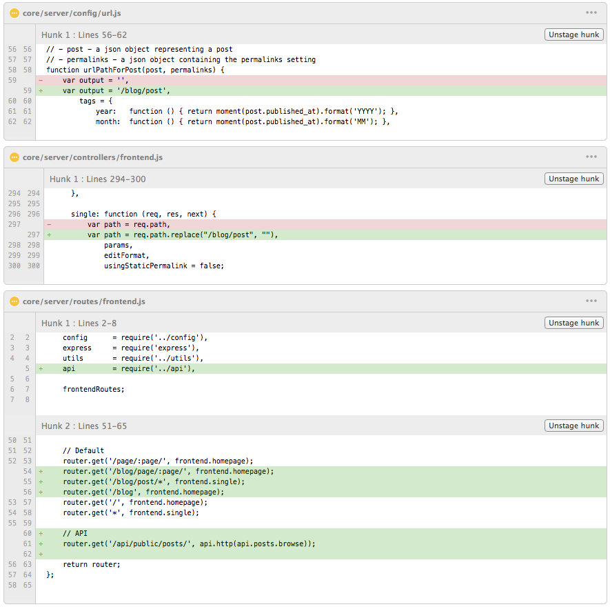

# //hedgehog.com.ua

## About projects
This is SPA application of my personal web site at hedgehog.com.ua, that is built by Google Closure Tools (Closure Library, Closure Compiler, Closure Templates).

### Install Grunt
From the command line:

1. Install `grunt-cli` globally with `npm install -g grunt-cli`.
2. Navigate to the root directory, then run `npm install`. npm will look at [package.json] and automatically install the necessary local dependencies listed there.

When completed, you'll be able to run the various Grunt commands provided from the command line.

### Grunt commands (general)
1. `grunt` (default task) - build Ghost theme to `/dist` folder and then copy to '/ghost/content/themes/hedgehog' folder.
2. `grunt watch` - monitor changes for *.js, *.hbs, *.less files and then run the proper command to make changes to the theme.

### Additional changes in Ghost engine that is required to do (actual for Ghost version 0.5.2):
